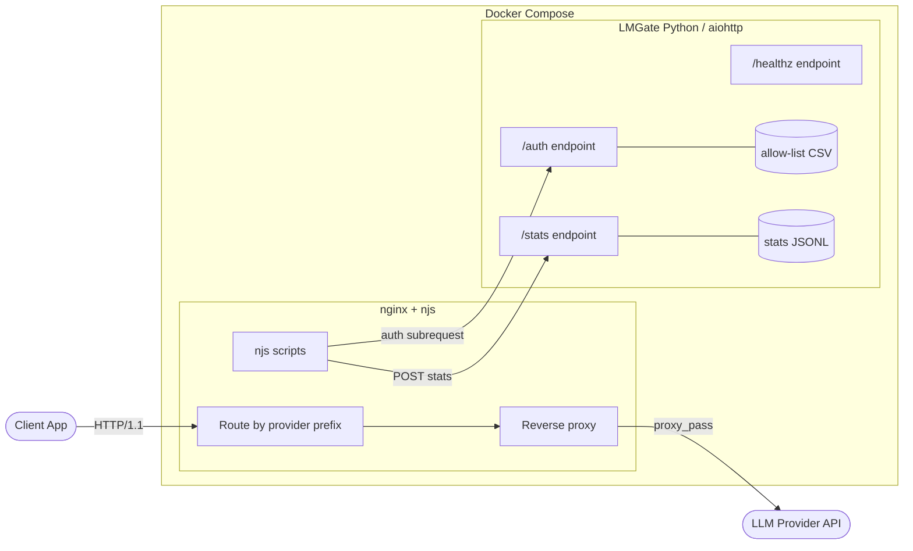
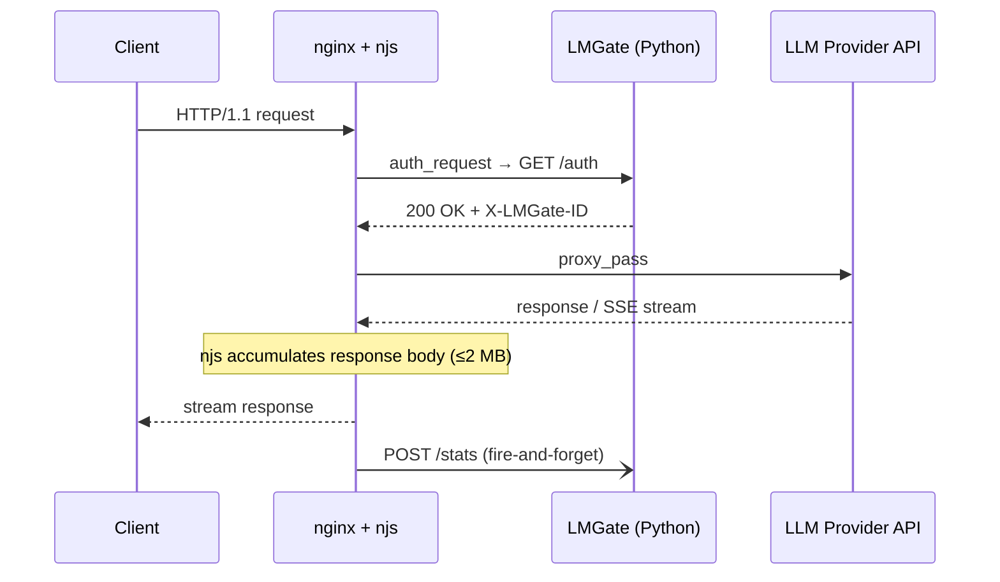
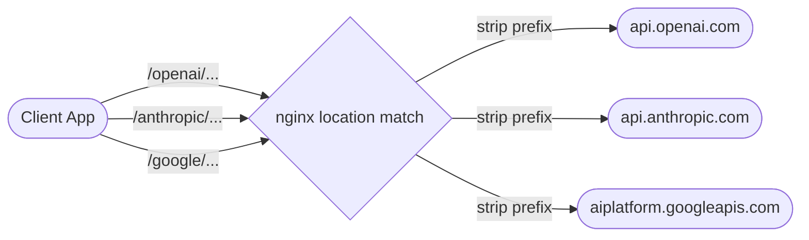
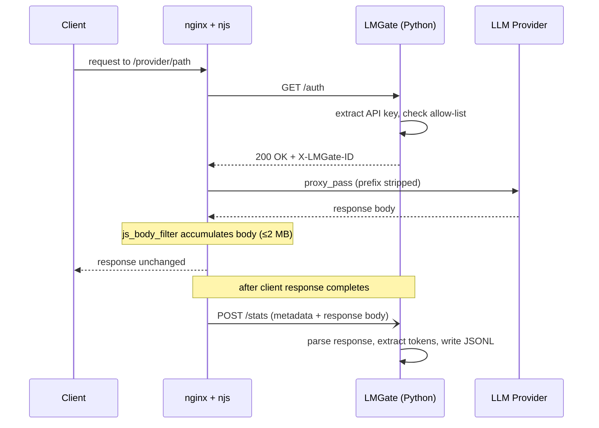

# LMGate MVP — Design Document

**Date**: 2026-02-16
**Input**: `docs/LMGate functional specification.md`

---

## 1. Architecture

LMGate is a two-process system deployed as Docker containers via docker-compose on a single host.

**Component responsibilities:**

| Component | Role |
|-----------|------|
| **nginx** | Reverse proxy — routes requests by provider prefix, strips prefix, forwards to upstream LLM provider. Streams SSE responses to clients without buffering. |
| **njs scripts** | Thin glue layer (~15 lines each) running inside nginx. Triggers auth subrequest before proxying, accumulates response body (≤2 MB cap) via `js_body_filter`, and fire-and-forget POSTs metadata to `/stats` after the response completes. Never parses or modifies request/response content. |
| **LMGate `/auth`** | Extracts API key from the request, performs O(1) lookup against the in-memory allow-list, returns 200 + `X-LMGate-ID` on match or 403 on failure. |
| **LMGate `/stats`** | Receives request metadata and accumulated response body from njs. Detects provider, extracts token counts, writes append-only JSONL records. Failures never propagate back to the client. |
| **LMGate `/healthz`** | Returns HTTP 200 — used by docker-compose to gate nginx startup on LMGate readiness. |
| **allow-list CSV** | File-based key registry. Loaded at startup, polled by mtime every 30s, atomically swapped on change. |
| **stats JSONL** | Append-only usage log. Buffered writes flushed every 10s, size-based rotation at 100 MB. |

**Request lifecycle (sequence):**

### Why two processes?

- **Maximize reuse**: nginx handles proxying, TLS, SSE streaming, and (post-MVP) HTTP/2 — no custom proxy code needed.
- **Minimal new code**: njs scripts are thin glue (~15 lines each). All business logic lives in Python.
- **Uniform REST interface**: nginx communicates with LMGate exclusively via HTTP (`/auth`, `/stats`) — consistent and debuggable, no shared filesystem for data exchange.

### Failure modes

- **AuthZ: fail closed** — if LMGate is unreachable, nginx returns 403.
- **Stats: fail open** — if the stats POST fails, proxying continues unaffected.

### Protocol support

| Protocol | MVP | Post-MVP |
|----------|-----|----------|
| HTTP/1.1 | Yes | Yes |
| SSE (streaming) | Yes (native nginx) | Yes |
| HTTP/2 (client-facing) | No | Config-only change (nginx native) |

---

## 2. Request Flow

### 2.0 Provider Routing

Clients send requests to LMGate using a provider path prefix. nginx matches the prefix to a `location` block, strips it, and proxies the remaining path to the provider's actual API host over HTTPS.

**Routing table:**

| Client request path | Prefix stripped | Upstream host | Upstream URL |
|---------------------|-----------------|---------------|--------------|
| `/openai/v1/chat/completions` | `/openai/` → `/` | `api.openai.com` | `https://api.openai.com/v1/chat/completions` |
| `/anthropic/v1/messages` | `/anthropic/` → `/` | `api.anthropic.com` | `https://api.anthropic.com/v1/messages` |
| `/google/v1/projects/.../generateContent` | `/google/` → `/` | `aiplatform.googleapis.com` | `https://aiplatform.googleapis.com/v1/projects/.../generateContent` |

**How prefix stripping works:** Each nginx `location /prefix/` block uses `proxy_pass https://upstream/;` — the trailing slash causes nginx to replace the matched prefix with `/`, forwarding only the remainder of the path. The `Host` header is explicitly set to the provider's real hostname so TLS SNI and virtual hosting work correctly.

**What nginx does per provider location block:**
1. `auth_request /_auth` — triggers the AuthZ subrequest before proxying
2. `proxy_pass https://upstream/` — forwards to the provider with prefix stripped
3. `proxy_ssl_server_name on` + `proxy_set_header Host` — correct TLS/SNI for the upstream
4. `proxy_buffering off` — enables unbuffered SSE streaming to the client
5. `js_body_filter stats.accumulate` — njs accumulates the response body for stats

### 2.1 Happy Path (Non-Streaming)

### 2.2 Key Design Decisions in the Flow

**`X-LMGate-ID` header correlation**: LMGate returns an internal key ID during `auth_request`. nginx passes it in the stats POST. This avoids LMGate needing to correlate auth and stats by API key later.

**njs body accumulation with cap**: njs copies response body chunks without blocking client streaming, enforcing a 2 MB cap. If exceeded, capture stops and token counts are marked `unknown`. njs never parses or interprets JSON — it forwards bytes only.

**SSE/streaming**: njs accumulates the full streamed body. Token counts are typically in the final SSE event. Best-effort extraction — if not found, stats entry has null token counts.

---

## 3. AuthZ Design

**Key extraction precedence** (first valid credential wins):
1. `Authorization: Bearer <key>`
2. `x-api-key`

**Allow-list**: CSV file, loaded at startup (missing file = FATAL). Polled by mtime every 30s, atomically swapped on change. In-memory `dict[str, AllowListEntry]` for O(1) lookup.

---

## 4. Stats Design

**Ingestion**: njs POSTs a JSON envelope containing request metadata and the full response body. LMGate detects provider from the upstream `host` field (e.g., `api.openai.com` → openai), parses `response_body` for token counts, and writes a JSONL record.

**Resilience**: Stats ingestion uses a bounded in-memory queue. Overflow drops stats entries but never blocks proxying. Graceful fallback — if response body is not JSON or token fields are missing, the entry is written with null token counts. Parse errors never crash the stats path.

**Output**: Append-only JSONL. Buffered async writes flushed on a configurable interval (default 10s). Size-based rotation with timestamp suffix.

---

## 5. Configuration Approach

- YAML config file as primary source.
- Environment variable overrides with `LMGATE_` prefix, double-underscore for nesting (e.g., `LMGATE_AUTH__POLL_INTERVAL_SECONDS`).
- nginx config is a separate file, not managed by the Python config system.

---

## 6. Out of Scope (MVP)

- AWS Bedrock — SigV4 request signing is incompatible with reverse proxy path/host rewriting; requires a gateway mode where LMGate holds AWS credentials and signs requests server-side
- TLS termination
- Stats query API / dashboard
- Multi-host / HA deployment
- Rate limiting
- Per-key permissions beyond allow/deny
